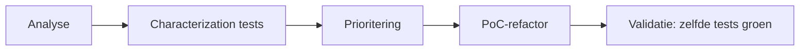
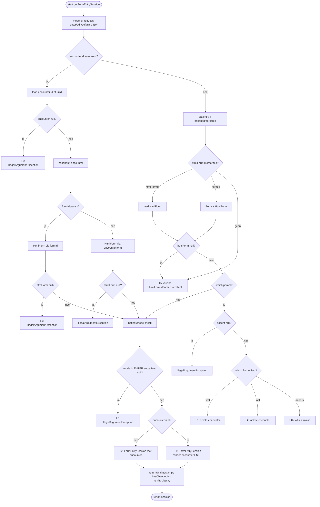

# Teststrategie — OpenMRS HTML Form Entry

**Project:** OpenMRS HTML Form Entry v3.10.0
**Versie:** 1.0
**Datum:** 15 juni 2026
**Baseline-commit:** `c67d09b` (2026-06-11)

**Gerelateerde documenten:**

| Document                             | Locatie                                                         |
| ------------------------------------ | --------------------------------------------------------------- |
| Onderhoudbaarheidsrapport (baseline) | [`onderhoudbaarheidsrapport.md`](onderhoudbaarheidsrapport.md)   |
| NFRs onderhoudbaarheid               | [`01-nfr-onderhoudbaarheid.md`](01-nfr-onderhoudbaarheid.md)     |
| Testresultaten baseline              | [`04-testresultaten-baseline.md`](04-testresultaten-baseline.md) |
| AI-verantwoording tests              | [`05-verantwoording-ai-tests.md`](05-verantwoording-ai-tests.md) |
| Validatie voor/na PoC                | [`07-validatie-voor-na.md`](07-validatie-voor-na.md)            |

---

## 1. Doel en scope

### 1.1 Doel

Deze teststrategie beschrijft **hoe** we de kwaliteit en testbaarheid van de OpenMRS HTML Form Entry-module bewaken en verbeteren in het kader van het onderhoudbaarheidsonderzoek. Concreet:

1. **Risico's vastleggen** — met name rond de PoC-hotspot `HtmlFormEntryController.getFormEntrySession` (cognitive complexity 52, vrijwel geen testdekking).
2. **Gedrag specificeren vóór refactoring** — characterization tests als vangnet voor de geplande Extract Class-refactor.
3. **Regressie voorkomen** — reproduceerbare testuitvoering lokaal en in CI.
4. **Meetwaarden vastleggen** — JaCoCo-coverage en Surefire-resultaten als baseline en validatie-input.

### 1.2 Scope-niveaus

| Niveau                    | Omschrijving                                                                   | Testrol                                                                     |
| ------------------------- | ------------------------------------------------------------------------------ | --------------------------------------------------------------------------- |
| **PoC-testscope**   | `omod` — webcontrollers, nieuwe klassen na extractie                        | Primair: nieuwe en bestaande tests moeten groen blijven                     |
| **Module-baseline** | `api`, `api-tests`, `api-1.x`                                            | Context: bestaande suite draaien en resultaten rapporteren                  |
| **Buiten scope**    | `FormEntrySession` (~1040 LOC), `release-tests`, volledige suite-reparatie | Vermelden als bekende technische schuld; geen fix-verplichting in deze fase |

De PoC-testscope sluit aan op de scope uit [`onderhoudbaarheidsrapport.md`](onderhoudbaarheidsrapport.md) §1.

---

## 2. Uitgangssituatie

Samenvatting baseline (commit `c67d09b`):

| Aspect                        | Module-breed                                     | PoC-scope (OMOD)                                                        |
| ----------------------------- | ------------------------------------------------ | ----------------------------------------------------------------------- |
| Line coverage (JaCoCo)        | 16,4%                                            | 1,9% (controller-pakket: 16,9%)                                         |
| Testklassen                   | 52 in `api-tests` + enkele in `api`/`omod` | 2 klassen, 9 tests (alle groen)                                         |
| `mvn test` volledige module | Rood — 529 tests, ~70 errors, 1 failure         | —                                                                      |
| CI (`deploy.yml`)           | `mvn package -DskipTests`                      | Geen teststap                                                           |
| PoC-hotspot                   | —                                               | `HtmlFormEntryController`: CC 52, 2,1% coverage, geen dedicated tests |

**Conclusie:** de module heeft een uitgebreid regressielandschap in `api-tests`, maar dat landschap is deels instabiel en niet gericht op de OMOD-hotspot. Een afgebakende, groene PoC-testscope is realistischer en inhoudelijk relevanter dan het repareren van alle bestaande failures.

---

## 3. Testfilosofie

### 3.1 Characterization testing vóór refactoring

We volgen geen klassieke test-driven development (TDD) voor nieuwe features. Wel hanteren we een **test-gedreven verbetercyclus** in de onderhoudbaarheidscontext:



| Fase            | Testrol                                                                       |
| --------------- | ----------------------------------------------------------------------------- |
| Analyse         | Testbaarheidsproblemen vastleggen (coverage, complexiteit, ontbrekende tests) |
| Tests opstellen | Gedrag van prio-1 hotspot vastleggen**vóór** refactor                 |
| PoC             | Refactor met bestaande tests als vangnet                                      |
| Validatie       | Zelfde tests opnieuw groen; metrieken voor/na documenteren                    |

Dit sluit aan bij het principe *"add tests before you change code"* (Fowler): tests beschrijven **observable gedrag** (request-parameters → `FormEntrySession` of exception), niet interne implementatie.

### 3.2 Risicogebaseerde dekking

Dekking wordt bepaald op basis van **geprioriteerde hotspots**, niet op een blanket coverage-percentage. JaCoCo dient als **meetwaarde** in baseline en validatie (NFR-M4). Na extractie streven we naar volledige dekking op de nieuwe, geïsoleerde klassen.

---

## 4. Testniveaus en testtypen

### 4.1 Testpiramide (PoC-scope)

```
                    ┌─────────────────────┐
                    │  Handmatige smoke   │  (optioneel, demo)
                    └──────────┬──────────┘
               ┌───────────────┴───────────────┐
               │  Component / integratie       │  Spring-context, MockHttpServletRequest
               │  (bestaand + nieuw)           │
               └───────────────┬───────────────┘
          ┌────────────────────┴────────────────────┐
          │  Unit tests (puur, Mockito)              │  Geëxtraheerde logica na PoC
          └────────────────────┬────────────────────┘
     ┌─────────────────────────┴─────────────────────────┐
     │  Statische analyse + coverage (JaCoCo, SonarCloud) │
     └─────────────────────────────────────────────────────┘
```

### 4.2 Overzicht testtypen

| # | Testtype                         | Doel                                      | Implementatie                                     | Bestaand voorbeeld                                 |
| - | -------------------------------- | ----------------------------------------- | ------------------------------------------------- | -------------------------------------------------- |
| 1 | **Unit**                   | Geïsoleerde logica zonder Spring-context | Mockito, pure JUnit                               | `HtmlFormEncounterControllerTest` (7 tests)      |
| 2 | **Component / integratie** | Controller met OpenMRS Spring-testcontext | `BaseModuleContextSensitiveTest` + mock request | `HtmlFormAjaxValidationControllerTest` (2 tests) |
| 3 | **Regressie (integratie)** | End-to-end form-entry via XML-formulieren | `RegressionTestHelper` in `api-tests`         | Diverse tag-tests                                  |
| 4 | **Coverage-metriek**       | Objectieve meetwaarde voor/na refactor    | JaCoCo via `mvn verify`                         | `pom.xml` JaCoCo 0.8.11                          |
| 5 | **SAST**                   | Statische kwaliteits- en security-analyse | SonarCloud / CodeQL in CI                         | NFR-S3                                             |

---

## 5. Testomgeving en tooling

| Component               | Specificatie                                                 |
| ----------------------- | ------------------------------------------------------------ |
| **JDK**           | Temurin 8                                                    |
| **Build**         | Maven 3.x, vanuit repo-root                                  |
| **Testframework** | JUnit 4, Spring Test (`MockHttpServletRequest`)            |
| **Mocking**       | Mockito (unit tests)                                         |
| **Testdata**      | OpenMRS module-datasets (`BaseModuleContextSensitiveTest`) |
| **Coverage**      | JaCoCo — rapport:`omod/target/site/jacoco/`               |
| **CI**            | GitHub Actions (dedicated quality-workflow, zie §8)         |
| **OS**            | Windows 11 (lokaal) /`ubuntu-latest` (CI)                  |

### Reproduceerbare commando's

```bash
# PoC-testscope + logging audit tests + JaCoCo (zoals CI)
mvn -B -pl api,api-tests,omod -am test verify

# Alleen formatter unit tests
mvn -pl api -Dtest=FormEntryAuditLogFormatterTest test

# Module-baseline (verwacht deels rood)
mvn -pl api,api-tests test

# Coverage rapporten
# api/target/site/jacoco/index.html
# api-tests/target/site/jacoco/index.html
# omod/target/site/jacoco/index.html
```

---

## 6. Testscope — in en uit scope

### 6.1 In scope

| Onderdeel                                       | Activiteit                                                    |
| ----------------------------------------------- | ------------------------------------------------------------- |
| `HtmlFormEntryController.getFormEntrySession` | Nieuwe characterization tests (6–8 scenario's)               |
| Bestaande OMOD-tests                            | Behouden en documenteren (9 tests, groen)                     |
| JaCoCo PoC-pakket                               | Meten en rapporteren als baseline                             |
| CI quality-workflow                             | `mvn -pl omod test verify` op PR/push                       |
| Regressie-subset                                | 5 representatieve groene tests uit `api-tests` documenteren |
| Geëxtraheerde klassen (na PoC)                 | Optioneel: unit tests met 100% dekking                        |

### 6.2 Buiten scope (deze fase)

| Onderdeel                                         | Reden                                             |
| ------------------------------------------------- | ------------------------------------------------- |
| Alle ~70 falende `api-tests` repareren          | Hoog effort, laag rendement voor PoC-focus        |
| `FormEntrySession` testen/refactoren            | ~1040 LOC, hoog regressierisico                   |
| `release-tests` smoke/integration               | Apart profiel, Jetty-server; te traag voor sprint |
| Blanket coverage-drempel (bijv. 60% module-breed) | Niet realistisch t.o.v. baseline 1,9% PoC-scope   |

Module-brede failures worden **eerlijk gerapporteerd** in [`04-testresultaten-baseline.md`](04-testresultaten-baseline.md) als bekende technische schuld, niet als testdoelstelling.

---

## 7. Testontwerp

### 7.1 Bestaande tests

| Testklasse                               | Module    | Tests | Status     | Rol                                                      |
| ---------------------------------------- | --------- | ----- | ---------- | -------------------------------------------------------- |
| `HtmlFormEncounterControllerTest`      | omod      | 7     | Groen      | Unit-model; dekt `buildSchemaAsJsonNode`, `getValue` |
| `HtmlFormAjaxValidationControllerTest` | omod      | 2     | Groen      | Spring-integratiemodel                                   |
| `api-tests` (volledig)                 | api-tests | 529   | ~70 errors | Module-baseline                                          |
| `DrugOrderTag1_10Test`                 | api-1.10  | 3     | NPE        | Module-baseline                                          |

### 7.2 Nieuwe tests — characterization + extract unit tests

**Patroon characterization:** volg [`HtmlFormAjaxValidationControllerTest`](../omod/src/test/java/org/openmrs/htmlformentry/web/controller/HtmlFormAjaxValidationControllerTest.java) — `BaseModuleContextSensitiveTest` + `MockHttpServletRequest`; roep `getFormEntrySession` direct aan.

**Volgorde:** characterization tests schrijven **vóór** Extract Method-refactor. Characterization tests blijven bij refactor **ongewijzigd** en zijn leidend voor regressie.

| Testklasse                       | Fase                  | Te testen gedrag                       | Aantal | Type      |
| -------------------------------- | --------------------- | -------------------------------------- | ------ | --------- |
| `HtmlFormEntryControllerTest`  | Nu                    | Request-parameters → sessie/exception | 6–8   | Component |
| `FormEntryRequestResolverTest` | Na PoC*(optioneel)* | Logica in geëxtraheerde klasse        | 4–6   | Unit      |
| `FormEntrySessionFactoryTest`  | Na PoC*(optioneel)* | Factory-keuze constructor              | 2–3   | Unit      |

**§7.2b — Extract unit tests (na merge refactor-branch):** `HtmlFormEntryControllerExtractedMethodsTest` en `FormEntrySessionValidateNotModifiedSinceTimestampsTest` vullen de characterization-laag aan; ze mogen het gedrag in §7.4 niet tegenspreken. `resolveFormEntryContext` wordt niet apart unit-getest (vereist `Context`/spy); die paden zitten in de characterization tests T1–T4 en T2.

### 7.3 Paden — `getFormEntrySession` (prio 1)

Bron: [`HtmlFormEntryController.java`](../omod/src/main/java/org/openmrs/module/htmlformentry/web/controller/HtmlFormEntryController.java) regels 82–225.



### 7.4 Traceability-matrix

| Pad-ID | Scenario                                            | Verwacht gedrag                       | Testmethode                                    | Prioriteit |
| ------ | --------------------------------------------------- | ------------------------------------- | ---------------------------------------------- | ---------- |
| T1     | Geen encounter,`htmlFormId` + patient, mode ENTER | Nieuwe sessie ENTER                   | `shouldCreateEnterSessionWithHtmlFormId`     | Must       |
| T2     | `encounterId` aanwezig                            | Sessie met bestaande encounter        | `shouldCreateViewSessionWithEncounterId`     | Must       |
| T3     | `which=first`                                     | Eerste encounter uit lijst            | `shouldSelectFirstEncounterWhenWhichIsFirst` | Must       |
| T4     | `which=last`                                      | Laatste encounter uit lijst           | `shouldSelectLastEncounterWhenWhichIsLast`   | Must       |
| T4b    | `which=invalid`                                   | `IllegalArgumentException`          | `shouldThrowWhenWhichIsInvalid`              | Must       |
| T5     | `formId` zonder HtmlForm                          | `IllegalArgumentException`          | `shouldThrowWhenNoHtmlFormForFormId`         | Must       |
| T6     | Ongeldig `encounterId`                            | `IllegalArgumentException`          | `shouldThrowWhenEncounterNotFound`           | Should     |
| T7     | mode VIEW zonder patient                            | `IllegalArgumentException`          | `shouldThrowWhenNoPatientInViewMode`         | Must       |
| T8     | `returnUrl` gezet                                 | Return URL op sessie                  | `shouldSetReturnUrlOnSession`                | Should     |
| T9     | `formModifiedTimestamp` mismatch                  | `RuntimeException` (form gewijzigd) | `shouldThrowWhenFormModified`                | Should     |

**Prioriteit:** *Must* = verplicht vóór PoC-refactor; *Should* = uitvoeren indien tijd beschikbaar, anders expliciet als "niet uitgevoerd" rapporteren.

### 7.5 Regressie-subset

Selecteer **5 bestaande groene tests** uit `api-tests` die het domein "form entry" raken (bijv. `ObsTagTest`, `HtmlFormTest`). Doel: aantonen dat de bestaande regressielaag naast de PoC-tests bestaat en deels functioneert.

**Actie:** draai `mvn -pl api-tests test`, exporteer groene klassen, kies de 5 meest relevante voor form-entry. Resultaat documenteren in [`04-testresultaten-baseline.md`](04-testresultaten-baseline.md).

### 7.6 Logging audit tests (security PoC)

Automated checks voor metadata-only audit logging (NFR-S1/S2). Traceability naar [`08-logging.md`](08-logging.md) §Validatie.

| Test | Type | Bewijst | Commando |
|------|------|---------|----------|
| `FormEntryAuditLogFormatterTest` | Unit (`api`) | Logberichten bevatten alleen numerieke IDs; geen PII-patronen; null → `none` | `mvn -pl api -Dtest=FormEntryAuditLogFormatterTest test` |
| `FormEntrySessionLoggingTest` | Integratie (`api`) | Null-patiënt sessie-pad zonder NPE (log niet geasserteerd) | `mvn -pl api -Dtest=FormEntrySessionLoggingTest test` |
| `FormEntrySessionTest` | Integratie (`api-tests`) | Sessie-start smoke; console kan `session.created` tonen | `mvn -pl api-tests -Dtest=FormEntrySessionTest test` |
| `PostSubmissionActionTagTest` | Integratie (`api-tests`) | Submit smoke; console kan `submit.success` tonen | `mvn -pl api-tests -Dtest=PostSubmissionActionTagTest test` |

SonarCloud new-code coverage: formatter-unit tests + integratietests via **`sonarcloud`**-job in CI (`api`, `api-tests`, `omod` JaCoCo-reports). De aparte `unit-test`-job draait alleen `omod`.

---

## 8. CI en reproduceerbaarheid

### 8.1 CI (`.github/workflows/ci.yml`)

Twee relevante jobs:

| Job | Maven-commando | Dekking |
|-----|----------------|---------|
| `unit-test` | `mvn -B -pl omod -am test verify` | OMOD PoC-scope (controllers); `-am` bouwt `api` eerst |
| `sonarcloud` | `mvn -B -pl api,api-tests,omod -am test verify` | OMOD + **logging audit tests** (`FormEntryAuditLogFormatterTest`, `FormEntrySessionLoggingTest`, `FormEntrySessionTest`, `PostSubmissionActionTagTest`) + JaCoCo voor SonarCloud |

SonarCloud aggregeert JaCoCo uit `api`, `api-tests` en `omod` (`pom.xml` / `sonar-project.properties`).

### 8.2 Metadata per testrun

Elk testrapport bevat minimaal:

| Veld           | Voorbeeld                     |
| -------------- | ----------------------------- |
| Git commit     | `c67d09b`                   |
| Datum/tijd     | 2026-06-15T09:00              |
| JDK            | Temurin 8                     |
| Maven-commando | `mvn -pl omod test verify`  |
| OS             | Windows 11 /`ubuntu-latest` |
| CI-run URL     | GitHub Actions run #…        |
| Artifact       | `jacoco-omod.zip`           |

### 8.3 JaCoCo-baseline

Controller-pakket (`org.openmrs.module.htmlformentry.web.controller`): **16,9%** (106/626 lines) op baseline-commit. Na PoC rapporteren we voor/na op hotspot-klassen (bijv. "was 2,1% op `HtmlFormEntryController`, na extractie: 85% op `FormEntryRequestResolver`").

---

## 9. Entry- en exitcriteria

### 9.1 Entry criteria (start testactiviteiten)

- [X] Baseline-analyse afgerond ([`onderhoudbaarheidsrapport.md`](onderhoudbaarheidsrapport.md))
- [X] PoC-hotspot geprioriteerd (`getFormEntrySession`, CC 52)
- [X] Lokale omgeving: JDK 8, `mvn -pl omod test` draait (19 tests groen)

### 9.2 Exit criteria (testfase afgerond)

- [X] Alle **Must**-paden (T1–T5, T7) + **Should** (T6, T8, T9) hebben groene test
- [X] `HtmlFormEntryControllerTest` lokaal groen via `mvn -pl omod test verify`
- [ ] CI quality-workflow groen op PR/push
- [X] [`04-testresultaten-baseline.md`](04-testresultaten-baseline.md) bijgewerkt
- [X] JaCoCo baseline + na characterization tests gedocumenteerd
- [ ] Regressie-subset (5 groene api-tests) gedocumenteerd

### 9.3 Pass/fail per testtype

| Testtype              | Criterium                        | Rapportage                     |
| --------------------- | -------------------------------- | ------------------------------ |
| Unit (PoC-scope)      | 100% groen                       | Surefire XML                   |
| Component (PoC-scope) | 100% groen                       | Surefire XML                   |
| Regressie-subset      | ≥ 5 representatieve tests groen | Lijst met testnaam + motivatie |
| JaCoCo                | Gemeten en gedocumenteerd        | CSV + link/screenshot          |
| SAST                  | 0 new critical op PoC-PR         | SonarCloud PR-comment          |

---

## 10. Deliverables

| Document / artifact          | Locatie                                                     | Fase              |
| ---------------------------- | ----------------------------------------------------------- | ----------------- |
| Teststrategie (dit document) | `docs/03-teststrategie.md`                                | Testfase          |
| Testresultaten baseline      | `docs/04-testresultaten-baseline.md`                      | Na testuitvoering |
| Testresultaten na PoC        | `docs/07-validatie-voor-na.md` (sectie tests)             | Validatiefase     |
| Nieuwe testklasse            | `omod/src/test/java/.../HtmlFormEntryControllerTest.java` | Testfase          |
| CI quality-workflow          | `.github/workflows/quality.yml`                           | Testfase          |
| JaCoCo-artifact              | CI artifact of screenshot in `docs/`                      | Testfase          |

---

## 11. Risico's en mitigatie

| Risico                                         | Kans   | Impact             | Mitigatie                                                      |
| ---------------------------------------------- | ------ | ------------------ | -------------------------------------------------------------- |
| PoC-refactor vertraagd                         | Middel | Laag voor testfase | Characterization tests staan klaar als vangnet                 |
| `api-tests` blijft deels rood                | Hoog   | Laag               | Eerlijk rapporteren als module-baseline; geen merge-blocker    |
| Onvoldoende paddekking hotspot                 | Middel | Hoog               | Minimaal 6 Must-scenario's op `getFormEntrySession`          |
| CI-tijd > 30 min                               | Laag   | Laag               | Alleen `omod`-module in quality-job                          |
| Tests koppelen aan implementatie i.p.v. gedrag | Middel | Hoog               | Tests op observable output; geen asserties op private methodes |

---

## 12. Koppeling met onderhoudbaarheidsonderzoek

| Onderhoudbaarheidsfase | Bijdrage van deze teststrategie                                  |
| ---------------------- | ---------------------------------------------------------------- |
| **Analyse**      | Testbaarheidsbelemmeringen uit rapport §4.4 direct geadresseerd |
| **Prioritering** | Tests gericht op prio-1 hotspot `getFormEntrySession`          |
| **Ontwerp**      | Testplan bepaalt welke extracties unit-testbaar zijn             |
| **PoC**          | Characterization tests als refactor-vangnet                      |
| **Validatie**    | Zelfde tests vóór/na groen; JaCoCo + CC als meetwaarden        |

---

## 13. Samenvatting

De teststrategie richt zich op de **PoC-hotspot** in OMOD: `HtmlFormEntryController.getFormEntrySession`. Door characterization tests te schrijven vóór de geplande Extract Class-refactor leggen we gedrag vast, beperken we regressierisico en maken we de refactor valideerbaar.

We combineren **meerdere testtypen** (unit, component, regressie-subset, coverage, SAST) binnen een **afgebakende, reproduceerbare scope** (`unit-test` + `sonarcloud` in CI). Module-brede instabiliteit documenteren we als baseline-context, zonder dat te verwarren met het primaire testdoel.
