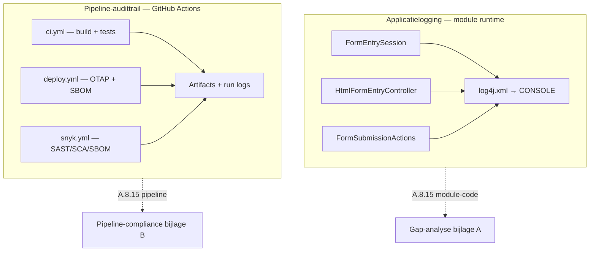

# Loggingplan — OpenMRS HTML Form Entry

**Project:** OpenMRS HTML Form Entry v3.10.0  
**Versie:** 1.0  
**Datum:** 15 juni 2026  
**Normkader:** NEN-7510:2024-2 (control A.8.15) · AVG · LU2-projectopdracht

**Gerelateerde documenten:**

| Document | Relatie |
|----------|---------|
| [`opdracht/non-functionals.md`](../opdracht/non-functionals.md) | NFR-S1 (0 PII in logs) · NFR-S2 (audit compliance) · NFR-S6 (pentest) |
| [`auditrapport/01-gap-analyse.md`](auditrapport/01-gap-analyse.md) | Bijlage A — baseline A.8.15 met codebewijs |
| [`auditrapport/02-pipeline-compliance.md`](auditrapport/02-pipeline-compliance.md) | Bijlage B — pipeline-audittrail |
| [`auditrapport/03-assets.md`](auditrapport/03-assets.md) | Kroonjuweel *audit-logbestanden* (BIV C=3 I=5 A=4) |
| [`auditrapport/04-risicomatrix.md`](auditrapport/04-risicomatrix.md) | D5 (onbevoegde inzage) · D6 (manipulatie audit-logs) |
| [`otap.md`](otap.md) | CI/CD-workflows en artifact-retentie |
| [`module-keuze.md`](module-keuze.md) | Motivatie audit logging als NEN-7510-scope |

---

## 1. Doel

Dit plan beschrijft **hoe** logging in en rond de HTML Form Entry-module voldoet aan de security- en compliance-eisen van de LU2-opdracht. Het dekt:

1. **Applicatielogging** — runtime-logboeken in de module (Log4j, Java-loggers).
2. **Pipeline-audittrail** — vastlegging van builds, scans en deploys in GitHub Actions.

Het plan is bedoeld als **uitvoerbaar verbeterdocument**: baseline → beleid → PoC-mitigatie → validatie. Het sluit aan op de gap-analyse (bijlage A) en de SMART-eisen NFR-S1 en NFR-S2.

---

## 2. Scope

| Onderdeel | In scope | Buiten scope |
|-----------|----------|--------------|
| Module-code (`api`, `omod`) | Logstatements, `log4j.xml`, audittrail op data (`creator`/`changedBy`) | OpenMRS Core-logging, Tomcat/server-config |
| CI/CD-pipeline | Workflow-logs, artifacts (SBOM, JaCoCo, Snyk) | Productie-host log-aggregatie (ELK/Splunk) — alleen als advies |
| Validatie | Pentest PII-in-logs, handmatige log-inspectie na PoC | Volledige Log4j 1.x → 2.x migratie (backlog HFE-001) |

**PoC-scope logging:** mitigatie van de kritieke PII-lek in `FormEntrySession` (zie §8). Overige verbeterpunten worden gedocumenteerd als geaccepteerd risico of vervolgactie.

---

## 3. Normkader en meetbare eisen

### 3.1 NEN-7510:2024-2 — A.8.15 Logging

> Logboeken die activiteiten, uitzonderingen, fouten en andere relevante gebeurtenissen registreren, moeten worden aangemaakt, opgeslagen, beschermd en geanalyseerd.

| Subeis | Planmatige invulling |
|--------|-------------------|
| Logs aanmaken | Gestandaardiseerde logcategorieën (§6); loggers in kernklassen |
| Opslaan | Console (huidig); RollingFileAppender als vervolgactie |
| Beschermen | Geen PII in logs (NFR-S1); pipeline-secrets via GitHub Secrets |
| Analyseren | Pentest + handmatige review; pipeline-artifacts voor supply-chain |

### 3.2 SMART NFR's (uit `non-functionals.md`)

| NFR | MoSCoW | Meetbaar criterium | Planmatige dekking |
|-----|--------|-------------------|-------------------|
| **NFR-S1** | MUST | 0 PII in logs; leak binnen 48 uur opgelost | §5 beleid · §8 PoC · §9 validatie |
| **NFR-S2** | MUST | 100% logs zonder directe PII; alleen metadata (ID, timestamp, user) | §5.2 toegestane velden · §8.1 fix |
| **NFR-S6** | MUST | Pentest op runtime-kwetsbaarheden; retest na fix | §9.2 pentest PII-in-logs |

### 3.3 AVG

Logs die patiëntidentiteit of medische inhoud bevatten, vallen onder bijzondere persoonsgegevens. Het beleid in §5 volgt het **dataminimalisatie**-principe: log alleen wat nodig is voor audit en troubleshooting, nooit volledige NAW of klinische waarden op INFO/WARN/ERROR.

---

## 4. Twee logginglagen



| Laag | Doel | Primaire norm | Status (baseline) |
|------|------|---------------|-------------------|
| **Applicatie** | Wie deed wat, wanneer; fouten bij form-verwerking | A.8.15 module · NFR-S1/S2 | ⚠️ PII-lek geïdentificeerd |
| **Pipeline** | Reproduceerbare build/deploy; supply-chain-bewijs | A.8.15 pipeline · NFR-S5 | ✅ Grotendeels aanwezig |

---

## 5. Loggingbeleid

### 5.1 Algemene regels

| # | Regel | Toelichting |
|---|-------|-------------|
| L1 | **Geen directe PII** in INFO, WARN of ERROR | Geen namen, BSN, geboortedatum, geslacht, vrije medische tekst |
| L2 | **Metadata-first** bij toegang tot patiëntdata | `patientId`, `userId`, `encounterId`, timestamp, actie-type |
| L3 | **DEBUG alleen in ontwikkeling** | DEBUG mag geen productie-default zijn; klinische waarden (`obs.getValueAsString`) niet loggen in productie |
| L4 | **Fouten zonder payload** | `log.error("Exception during form validation", ex)` — stacktrace ja, request-body/PII nee |
| L5 | **Audittrail op data** blijft via OpenMRS API | `setCreator` / `setChangedBy` — aanvullend op logs, niet vervangen |
| L6 | **Beveiligingsgebeurtenissen** expliciet categoriseren | Auth-fouten, privilege-denial (vervolgactie: aparte logger `htmlformentry.security`) |

### 5.2 Toegestane logvelden (conform NFR-S2)

| Veld | Voorbeeld | Toegestaan |
|------|-----------|------------|
| Patiënt-ID (intern) | `patientId=42` | ✅ |
| Gebruiker-ID | `userId=7` / `username=admin` | ✅ |
| Encounter-/formulier-ID | `encounterId=101`, `formId=3` | ✅ |
| Actie | `action=FormEntrySession.created` | ✅ |
| Timestamp | ISO8601 via Log4j pattern | ✅ |
| Duur (performance) | `durationMs=230` | ✅ |
| Patiëntnaam | `names=John Doe` | ❌ |
| Geboortedatum | `dob=1980-01-15` | ❌ |
| Geslacht | `gender=M` | ❌ |
| Klinische waarde | `Hemoglobin = 12.3` | ❌ (ook op DEBUG in productie) |
| Stacktrace bij exception | Zonder request-parameters | ✅ |

### 5.3 Logniveaus per omgeving

| Omgeving | OTAP-branch | Default level module `org.openmrs.module.htmlformentry` | Rationale |
|----------|-------------|----------------------------------------------------------|-----------|
| Ontwikkeling | `development` | INFO | Voldoende detail lokaal; geen DEBUG met klinische data |
| Test | `pre-release` | INFO | Reproduceerbaar gedrag t.o.v. acceptatie |
| Acceptatie | `acceptatie` | INFO | Representatief voor productie-audit |
| Productie | `main` | WARN | Alleen waarschuwingen en fouten; minder volume, minder risico |

> **Huidige configuratie** (`api/src/main/resources/log4j.xml`): DEBUG voor de hele module op alle omgevingen — wijkt af van dit beleid (§7.2).

---

## 6. Logcategorieën

| Categorie | Logger / locatie | Niveau | Inhoud | NEN-relevantie |
|-----------|------------------|--------|--------|----------------|
| **Toegang** | `FormEntrySession` | INFO | Sessie-start: patientId, userId, actie | A.8.15 — wie heeft formulier geopend |
| **Verwerking** | `HtmlFormEntryController` | ERROR | Validatie-/submit-fouten (exception only) | A.8.15 — uitzonderingen |
| **Wijziging data** | `FormSubmissionActions` | DEBUG → *uit in prod* | Void/change obs — alleen IDs, geen waarden | A.8.15 — audittrail |
| **Service** | `HtmlFormEntryServiceImpl` | INFO/ERROR | CRUD HTML forms, DAO-fouten | Operationeel |
| **Security** | *(vervolg)* `htmlformentry.security` | WARN | Auth-failures, privilege-denial | A.8.3 / A.8.5 |
| **Performance** | `HtmlFormEntryController` | INFO | `Took X ms` — geen patiëntcontext | Operationeel |
| **Pipeline** | GitHub Actions | — | Build, test, deploy, scan-resultaten | A.8.15 pipeline |

---

## 7. Uitgangssituatie (baseline)

Samenvatting uit [`01-gap-analyse.md`](auditrapport/01-gap-analyse.md) §A.8.15:

| # | Subeis | Status |
|---|--------|--------|
| 1–2 | Framework + loggers aanwezig | ✅ |
| 3–8 | Toegangslogging, foutlogging, creator/changedBy, wijzigingsregistratie | ✅ (deels met PII-risico op DEBUG) |
| 9 | Logbescherming (integriteit) | ❌ |
| 10 | Gecentraliseerde aggregatie | ❌ |
| 11 | Retentiebeleid | ❌ |
| 12 | Beveiligingsgebeurtenissen apart | ⚠️ |
| 13 | PII conform AVG/NEN-7510 | ⚠️ **kritiek** |

### 7.1 Kritieke bevinding — PII in INFO-log

Locatie: `api/src/main/java/org/openmrs/module/htmlformentry/FormEntrySession.java` (regels 145–148)

```java
log.info("FormEntrySession created: patient=" + patient.getPatientIdentifier()
        + " dob=" + patient.getBirthdate()
        + " gender=" + patient.getGender()
        + " names=" + patient.getPersonName());
```

**Schending:** NFR-S1, NFR-S2, AVG dataminimalisatie.  
**Risico:** D5 (onbevoegde inzage) — logs kunnen worden geraadpleegd door beheerders zonder behandelrelatie.

### 7.2 Secundaire bevinding — DEBUG met klinische waarden

Locatie: `FormSubmissionActions.java` — `printObsHelper()` logt `obs.getValueAsString()` op DEBUG.

**Risico:** Bij DEBUG-niveau (huidige default) kunnen medische waarden in logs verschijnen.

### 7.3 Configuratie `log4j.xml`

| Aspect | Huidig | Beleid (§5.3) |
|--------|--------|---------------|
| Appender | Alleen `CONSOLE` | Vervolg: `RollingFileAppender` |
| Module level | DEBUG | INFO (dev/test/acc) · WARN (prod) |
| Retentie | Geen | Min. 1 jaar (advies NEN-7510 medische context) |
| Log4j-versie | 1.x (EOL, HFE-001) | Migratie buiten PoC-scope |

### 7.4 Pipeline-audittrail (reeds aanwezig)

Zie [`02-pipeline-compliance.md`](auditrapport/02-pipeline-compliance.md):

- OMOD-artifact (365 dagen retentie)
- JaCoCo-rapport (30 dagen)
- SPDX SBOM + CycloneDX via Snyk
- Workflow run logs (90 dagen, GitHub default)
- Smoke test na deploy

**Conclusie baseline:** pipeline-laag voldoet grotendeels; applicatielaag vereist PoC-mitigatie en beleidsafstemming.

---

## 8. Implementatieplan

### Fase 1 — PoC-mitigatie PII (MUST, sprint huidige week)

**Doel:** NFR-S1 en NFR-S2 aantoonbaar halen voor de primaire toegangslog.

| # | Actie | Bestand | Eigenaar |
|---|-------|---------|----------|
| 1.1 | Vervang PII-log door metadata-only | `FormEntrySession.java:145-148` | Dev |
| 1.2 | Voeg `userId` toe via `Context.getAuthenticatedUser().getUserId()` | `FormEntrySession.java` | Dev |
| 1.3 | Stel logniveau module in op INFO | `log4j.xml` | Dev |
| 1.4 | Review DEBUG-statements in `FormSubmissionActions` — geen klinische waarden loggen | `FormSubmissionActions.java` | Dev |

**Doel-logregel (1.1 + 1.2):**

```java
log.info("FormEntrySession created: patientId=" + patient.getPatientId()
        + " userId=" + Context.getAuthenticatedUser().getUserId()
        + " action=session.created");
```

**Acceptatie Fase 1:**

- [ ] Geen `names=`, `dob=`, `gender=` in applicatielog na form-open
- [ ] Handmatige inspectie: `grep` op logoutput na test-submit
- [ ] Unit- of integratietest die loginhoud assert (optioneel, aanbevolen)

### Fase 2 — Beleid afdwingen in code review (SHOULD, parallel)

| # | Actie |
|---|-------|
| 2.1 | PR-checklist: geen nieuwe logregels met PII |
| 2.2 | Documenteer uitzonderingen (indien onvermijdelijk) met risicoacceptatie |
| 2.3 | Overweeg aparte logger `htmlformentry.security` voor auth-events |

### Fase 3 — Infrastructuur logging (COULD, buiten PoC)

| # | Actie | Reden buiten PoC |
|---|-------|------------------|
| 3.1 | `RollingFileAppender` + retentie 365 dagen | Vereist server/deploy-config buiten module |
| 3.2 | Centrale log-aggregatie (ELK, Loki) | Organisatie-inrichting, niet modulespecifiek |
| 3.3 | Log4j 1.x → 2.x migratie (HFE-001) | Platform-brede impact, apart backlog-item |
| 3.4 | Integriteitsbewaking logs (hash chain, WORM) | D6 mitigatie — vervolgproject |

**Geaccepteerd risico (PoC-grens):** Fase 3-items worden vastgelegd in auditrapport §6 met verwijzing naar security backlog; ze blokkeren de PoC-validatie niet mits Fase 1 geslaagd is.

---

## 9. Validatie

### 9.1 Acceptatiecriteria (Definition of Done)

| # | Criterium | Bewijs |
|---|-----------|--------|
| V1 | 0 directe PII in INFO/WARN/ERROR na form-sessie | Screenshot/logfragment vóór en na PoC |
| V2 | Alleen metadata (patientId, userId, timestamp, actie) in toegangslog | Code-review + log-inspectie |
| V3 | DEBUG niet default in `log4j.xml` voor module | Diff `log4j.xml` |
| V4 | Pentest PII-in-logs uitgevoerd en gedocumenteerd | Pentest-rapport (bijlage) |
| V5 | Pipeline-audittrail ongewijzigd functioneel | Bestaande CI-run + artifacts |

### 9.2 Penetration test — PII-in-logs (NFR-S6)

**Doel:** Aantonen dat patiëntgegevens in applicatielogs leesbaar waren (vóór fix) en niet meer verschijnen (na fix).

| Stap | Actie | Verwacht resultaat |
|------|-------|-------------------|
| 1 | Deploy module op OTAP (acceptatie-omgeving) | OpenMRS bereikbaar |
| 2 | Login als testgebruiker met formulierrechten | Geauthenticeerde sessie |
| 3 | Open HTML-formulier voor testpatiënt | `FormEntrySession` wordt aangemaakt |
| 4 | Inspecteer applicatielog (console of Tomcat `catalina.out`) | **Vóór fix:** naam/dob zichtbaar · **Na fix:** alleen patientId/userId |
| 5 | Documenteer met timestamp, gebruiker, stappen, logfragment | Navolgbaar pentest-rapport |
| 6 | Hertest binnen 3 werkdagen na merge (NFR-S6) | Bevestiging fix |

**Optioneel — geautomatiseerde check:**

```bash
# Na testsessie: geen PII-patronen in log
grep -E "names=|dob=|gender=" catalina.out && echo "FAIL: PII found" || echo "PASS"
```

### 9.3 Koppeling risicomatrix

| Dreiging | Hoe dit plan helpt |
|----------|-------------------|
| D5 — Onbevoegde inzage | Metadata-logging + geen PII in plaintext verkleint impact bij log-inzage |
| D6 — Manipulatie audit-logs | Fase 3 (integriteit); pipeline-artifacts als secundair bewijs |
| D2 — Datalek | Minder gevoelige data in logbestanden |

---

## 10. Pipeline-audittrail — onderhoud

Geen wijziging vereist voor PoC; wel borgen dat bestaande maatregelen actief blijven:

| Artifact | Workflow | Retentie | Control |
|----------|----------|----------|---------|
| OMOD-build | `deploy.yml` | 365 dagen | A.8.15 |
| JaCoCo | `deploy.yml` / `ci.yml` | 30 dagen | A.8.15 / NFR-T1 |
| SPDX SBOM | `deploy.yml` | In bundle | A.8.15 / NFR-S5 |
| Snyk-resultaten | `snyk.yml` | Artifact run | A.8.15 / NFR-S3 |
| Deploy smoke test | `smoke-test.sh` | Workflow-log | A.8.15 |

**Aanbeveling:** verleng JaCoCo-retentie naar 90–365 dagen voor volledige audit-pariteit met OMOD (zie `02-pipeline-compliance.md`).

---

## 11. Verantwoordelijkheden

| Rol | Taken |
|-----|-------|
| **Developer (PoC)** | Fase 1 code-wijzigingen, unit test log-gedrag |
| **Security / audit** | Pentest §9.2, rapportage in auditrapport |
| **Pipeline (BasMac-rol)** | Artifact-retentie, CI-bewijs vastleggen |
| **Auditor (Floris-rol)** | Koppeling naar bijlage A, traceability matrix |

---

## 12. Planning (1 week)

| Dag | Activiteit | Output |
|-----|------------|--------|
| 1 | Fase 1.1–1.3 implementeren | PR met log-fix |
| 1–2 | Baseline pentest (vóór of op oude branch) | Bewijs PII-lek |
| 2 | `log4j.xml` + FormSubmissionActions review | Config-diff |
| 3 | Merge + deploy acceptatie | Groene CI |
| 3–4 | Hertest pentest (na fix) | PASS-logfragment |
| 4–5 | Auditrapport §4/§6 bijwerken met logging-bevindingen | Afgeronde documentatie |

---

## 13. Referenties en traceability

| Eis | Bron | Dit plan |
|-----|------|----------|
| 0 PII in logs | NFR-S1 | §5, §8 Fase 1, §9 |
| Metadata-only logging | NFR-S2 | §5.2, §8.1 |
| A.8.15 module | NEN-7510 | §3.1, §7, §8 |
| A.8.15 pipeline | NEN-7510 | §4, §10 |
| Pentest PII | `voortgang-en-todo.md` | §9.2 |
| PII-bevinding | `01-gap-analyse.md` §A.8.15 | §7.1 |
| Kroonjuweel audit-logs | `03-assets.md` | §1, §5 |
| Log4j EOL | Security backlog HFE-001 | §7.3, §8 Fase 3 |

---

*Versie 1.0 — 15 juni 2026. Bijlage voor auditrapport (logging / A.8.15 verbeterplan).*
