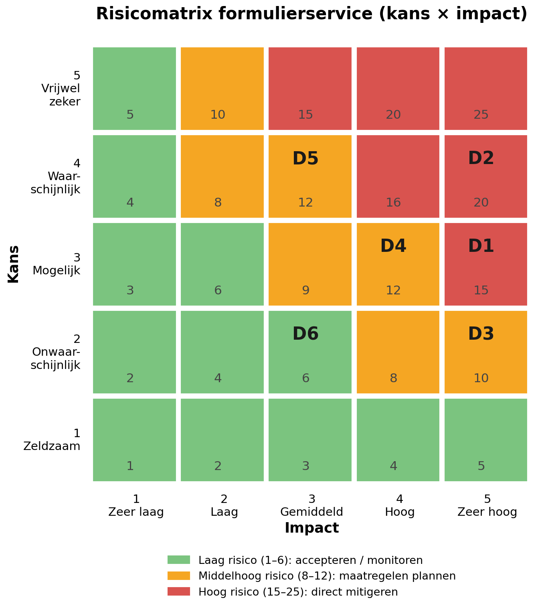

# 4. Risicomatrix

## 4.1 Methodiek

De risicobeoordeling is uitgevoerd volgens de klassieke formule **risico = kans × impact**, beide gescoord op een schaal van 1 t/m 5. De dreigingen zijn afgeleid van de kroonjuwelen uit de assetlijst. Per dreiging is aangegeven welk onderdeel van de CIA-triade primair wordt geraakt.

**Schaalverdeling kans:** 1 = zeldzaam, 2 = onwaarschijnlijk, 3 = mogelijk, 4 = waarschijnlijk, 5 = vrijwel zeker.
**Schaalverdeling impact:** 1 = zeer laag, 2 = laag, 3 = gemiddeld, 4 = hoog, 5 = zeer hoog.

**Kleurcodering risicoscore:**

| Score | Kleur | Betekenis |
|---|---|---|
| 1 – 6 | 🟢 Groen | Laag risico: accepteren en periodiek monitoren |
| 8 – 12 | 🟠 Oranje | Middelhoog risico: maatregelen plannen binnen de planningscyclus |
| 15 – 25 | 🔴 Rood | Hoog risico: direct mitigeren, prioriteit voor management |

## 4.2 Dreigingenoverzicht

| Nr | Dreiging | Geraakte asset(s) | CIA | Kans | Impact | Score | Risiconiveau |
|---|---|---|---|---|---|---|---|
| D1 | **Ransomware-aanval** op de formulierservice en gekoppelde systemen: data wordt versleuteld, klinische workflow valt stil | Klinische obs-data, medicatieorders, zorgproces­continuïteit | A, I, C | 3 | 5 | **15** | 🔴 Hoog |
| D2 | **Datalek van patiëntgegevens** via phishing of gestolen inloggegevens van zorgmedewerkers | Patiëntidentiteit, klinische obs-data | C | 4 | 5 | **20** | 🔴 Hoog |
| D3 | **Integriteitsfout in medicatieorders** door een softwarefout of mislukte synchronisatie, met risico op verkeerde dosering | Medicatieorders | I | 2 | 5 | **10** | 🟠 Middelhoog |
| D4 | **Uitval van de formulierservice** door een storing of DDoS-aanval, waardoor het klinisch proces terugvalt op papier | Zorgproces­continuïteit | A | 3 | 4 | **12** | 🟠 Middelhoog |
| D5 | **Onbevoegde inzage door eigen medewerkers** in dossiers zonder behandelrelatie | Klinische obs-data, patiëntidentiteit | C | 4 | 3 | **12** | 🟠 Middelhoog |
| D6 | **Manipulatie of verlies van audit-logbestanden**, waardoor verantwoording en detectie van misbruik wordt bemoeilijkt | Audit-logbestanden | I | 2 | 3 | **6** | 🟢 Laag |

## 4.3 Risicomatrix (visueel)

*Figuur 4.1 — Risicomatrix kans × impact. De posities D1 t/m D6 corresponderen met de dreigingen uit tabel 4.2.*

## 4.4 Toelichting per dreiging

**D1 — Ransomware (15, rood).** De zorgsector is een veelvoorkomend doelwit van ransomware. Omdat de formulierservice direct het klinische workflow ondersteunt, raakt versleuteling zowel de beschikbaarheid als de integriteit en vertrouwelijkheid van vrijwel alle kroonjuwelen tegelijk. De kans is groot, de impact maximaal.

**D2 — Datalek via phishing (20, rood).** Het hoogste risico in de matrix. Phishing op zorgmedewerkers is een van de meest voorkomende aanvalsvectoren, en de assets bevatten bijzondere persoonsgegevens in de zin van AVG. Een lek leidt tot meldplicht bij de Autoriteit Persoonsgegevens, mogelijke boetes en reputatieschade.

**D3 — Integriteitsfout medicatieorders (10, oranje).** De kans op een onopgemerkte synchronisatie- of softwarefout is relatief klein, maar de impact is maximaal: een verkeerde dosering kan directe patiëntschade veroorzaken. Dit sluit aan op de BIV-classificatie van medicatieorders en de eisen uit de Wet BIG en NEN 7510-2 §A.14.

**D4 — Uitval formulierservice (12, oranje).** Bij uitval moet het zorgproces terugvallen op papieren noodprocedures, met vertraging en foutgevoeligheid als gevolg. De beschikbaarheidseis voor zorgproces­continuïteit (NEN 7510-1 §6.1, BIO 17.1) maakt dit een aandachtspunt, maar de impact blijft beheersbaar zolang noodprocedures bestaan.

**D5 — Onbevoegde inzage door medewerkers (12, oranje).** Inzage zonder behandelrelatie komt in de praktijk regelmatig voor en raakt de vertrouwelijkheid van patiëntgegevens. De impact per incident is doorgaans beperkter dan bij een grootschalig extern lek (3), maar logging en controle hierop is verplicht (NEN 7510-2 §A.12.4, WGBO art. 7:454).

**D6 — Manipulatie of verlies van audit-logs (6, groen).** De kans is klein omdat logbestanden alleen door beheerders benaderbaar zijn, en er ontstaat geen directe patiëntschade. Wel verzwakt het de detectie van D5 en de verantwoordingsplicht; daarom blijft periodieke monitoring en integriteitsbewaking van de logs gewenst.

## 4.5 Conclusie

Twee dreigingen (D1 ransomware en D2 datalek via phishing) vallen in het rode gebied en vereisen directe mitigerende maatregelen. De drie oranje risico's (D3, D4, D5) worden opgenomen in het maatregelenplan; het groene risico D6 wordt geaccepteerd onder voorwaarde van logcontrole.
