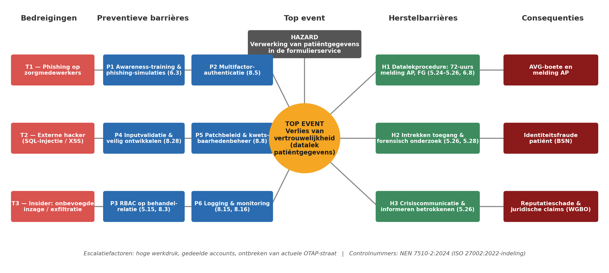
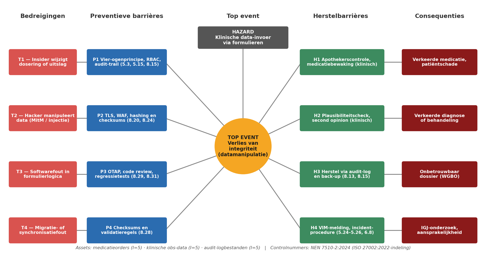
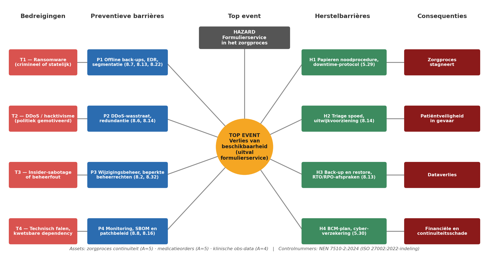

# 5. Bow-tie-analyse

## 5.1 Aanpak

De bow-tie-analyse is uitgevoerd voor **elk deel van de BIV-triade**, zodat de drie topgebeurtenissen uit de risicomatrix volledig zijn gedekt:

| Bow-tie | BIV-aspect | Top event | Gekoppelde dreiging(en) uit matrix | Score |
|---|---|---|---|---|
| 1  | **V** — Vertrouwelijkheid | Datalek patiëntgegevens | D2 (phishing/gestolen credentials), D5 (insider-inzage) | **20** 🔴 / 12 🟠 |
| 2  | **I** — Integriteit | Datamanipulatie klinische gegevens | D3 (integriteitsfout medicatieorders), D6 (manipulatie audit-logs) | 10 🟠 / 6 🟢 |
| 3  | **B** — Beschikbaarheid | Uitval formulierservice | D1 (ransomware), D4 (storing/DDoS) | **15** 🔴 / 12 🟠 |

Het risico met de hoogste score — **D2, datalek via phishing (20)** — In elke bow-tie staan links de bedreigingen met preventieve maatregelen die de kans verkleinen, rechts de herstel maatregelen die de schade beperken. Elke maatregel is gekoppeld aan een beheersmaatregel uit **NEN 7510-2:2024**. Als verplichte dreigingscategorieën zijn telkens hackers, insiders en politieke/statelijke factoren meegenomen.

## 5.2 Bow-tie 1 — Vertrouwelijkheid: datalek patiëntgegevens (hoogste risico, D2)

- **Hazard:** de verwerking van bijzondere persoonsgegevens in de HTML Form Entry-formulierservice.
- **Top event:** verlies van vertrouwelijkheid — onbevoegde toegang tot of lek van patiëntgegevens.
- **Geraakte assets:** klinische obs-data , medicatieorders, patiëntidentiteit.

*Figuur 5.1 — Bow-tie vertrouwelijkheid: top event "datalek patiëntgegevens" (D2, score 20).*

### Bedreigingen

| Nr | Bedreiging | Toelichting |
|---|---|---|
| T1 | Phishing op zorgmedewerkers | Meest waarschijnlijke aanvalsvector; buitgemaakte inloggegevens geven directe toegang tot de formulierservice |
| T2 | Externe hacker via webkwetsbaarheid | SQL-injectie of XSS in de formulierverwerking; de module rendert door gebruikers gedefinieerde HTML-formulieren |
| T3 | Insider: onbevoegde inzage of exfiltratie | Inzage zonder behandelrelatie of doelbewuste export van patiëntdata |

### Preventieve maatregelen

| Nr | maatregel | NEN 7510-2:2024 control | Werkt tegen |
|---|---|---|---|
| P1 | Security-awarenesstraining en phishing-simulaties | 6.3 — Bewustwording, opleiding en training | T1 |
| P2 | Multifactorauthenticatie op alle accounts met toegang tot patiëntdata | 8.5 — Beveiligde authenticatie | T1, T2 |
| P3 | Role-based access control gekoppeld aan de behandelrelatie, minimale rechten | 5.15 — Toegangsbeheersing; 8.3 — Beperking van toegang tot informatie | T3 |
| P4 | Inputvalidatie en veilige ontwikkelpraktijken in de formulierverwerking | 8.28 — Veilig coderen | T2 |
| P5 | Patchbeleid en kwetsbaarhedenbeheer voor module, platform en dependencies | 8.8 — Beheer van technische kwetsbaarheden | T2 |
| P6 | Logging en monitoring van toegang tot dossiers, met detectie van afwijkend inzagegedrag | 8.15 — Loggen; 8.16 — Monitoren van activiteiten | T1, T2, T3 |

### Herstel maatregelen

| Nr | maatregel                                                                                                  | NEN 7510-2:2024 control | Beperkt |
|---|-----------------------------------------------------------------------------------------------------------|---|---|
| H1 | Datalekprocedure: melding aan de Autoriteit Persoonsgegevens binnen 72 uur                  | 5.24 — Plannen en voorbereiden van incidentbeheer; 5.25 — Beoordeling van informatiebeveiligingsgebeurtenissen; 5.26 — Reactie op incidenten; 6.8 — Melden van gebeurtenissen | AVG-boete, escalatie van het lek |
| H2 | Direct intrekken van gecompromitteerde accounts en sessies, gevolgd door onderzoek naar de omvang | 5.26 — Reactie op incidenten; 5.28 — Verzamelen van bewijsmateriaal | Verdere exfiltratie, identiteitsfraude met BSN |
| H3 | Crisiscommunicatie en het informeren van betrokken patiënten                        | 5.26 — Reactie op incidenten | Reputatieschade, juridische claims (WGBO) |

Zonder werkende herstelbarrières leidt dit top event tot een **meldplichtig datalek met mogelijke AVG-boete**, **identiteitsfraude** door de combinatie van BSN en medische gegevens, **reputatieschade** en **juridische claims** op grond van de WGBO.

## 5.3 Bow-tie 2 — Integriteit: datamanipulatie klinische gegevens

- **Hazard:** klinische data-invoer via formulieren.
- **Top event:** verlies van integriteit — gemanipuleerde of corrupte klinische gegevens.
- **Geraakte assets:** medicatieorders, klinische obs-data, audit-logbestanden.

*Figuur 5.2 — Bow-tie integriteit: top event "datamanipulatie".*

| Bedreiging | Preventieve maatregel (control)                                                                              | Herstelbarrière (control) | Consequentie |
|---|--------------------------------------------------------------------------------------------------------------|---|---|
| T1 — Insider wijzigt dosering of uitslag | P1 Vier-ogenprincipe, RBAC, audit-trail (5.3 — Functiescheiding; 5.15; 8.15)                                 | H1 Apothekerscontrole, medicatiebewaking (klinische barrière) | Verkeerde medicatie, patiëntschade |
| T2 — Hacker manipuleert data (MitM, injectie) | P2 TLS, WAF, hashing en checksums (8.20 — Netwerkbeveiliging; 8.24 — Gebruik van cryptografie)               | H2 Plausibiliteitscheck, second opinion (klinische barrière) | Verkeerde diagnose of behandeling |
| T3 — Softwarefout in formulierlogica | P3 OTAP-straat, code review, regressietests (8.29 — Testen van beveiliging; 8.31 — Scheiding van omgevingen) | H3 Herstel via audit-log en back-up (8.13 — Back-up van informatie; 8.15) | Onbetrouwbaar dossier (WGBO) |
| T4 — Migratie- of synchronisatiefout | P4 Checksums en validatieregels (8.28 — Veilig coderen)                                                      | H4 VIM-melding, incidentprocedure (5.24–5.26; 6.8) | IGJ-onderzoek, aansprakelijkheid |

De integriteits-bow-tie twee **klinische herstelbarrières**: de apothekerscontrole en de plausibiliteitscheck door een tweede zorgverlener vangen fouten op die technische maatregelen passeren. Dit illustreert dat barrières niet uitsluitend technisch hoeven te zijn, mits hun werking aantoonbaar is.

## 5.4 Bow-tie 3 — Beschikbaarheid: uitval formulierservice

- **Hazard:** de formulierservice als schakel in het zorgproces.
- **Top event:** verlies van beschikbaarheid — de formulierservice is niet bruikbaar voor de klinische workflow (sluit aan op D1 en D4 uit de matrix).
- **Geraakte assets:** zorgproces­continuïteit, medicatieorders, klinische obs-data.

*Figuur 5.3 — Bow-tie beschikbaarheid: top event "uitval formulierservice" (D1, score 15; D4, score 12).*

| Bedreiging | Preventieve maatregel (control)                                                                                                 | Herstel maatregel (control)                                                                    | Consequentie |
|---|------------------------------------------------------------------------------------------------------------------------|------------------------------------------------------------------------------------------------|---|
| T1 — Ransomware | P1 Offline back-ups, EDR, netwerksegmentatie (8.7 — Bescherming tegen malware; 8.13; 8.22 — Segmentering van netwerken) | H1 Papieren noodprocedure, downtime-protocol (5.29 — Informatiebeveiliging tijdens verstoring) | Zorgproces stagneert |
| T2 — DDoS / hacktivisme | P2 DDoS-wasstraat, redundantie (8.6 — Capaciteitsbeheer; 8.14 — Redundantie van faciliteiten)                          | H2 Triage spoed, uitwijkvoorziening (8.14)                                                     | Patiëntveiligheid in gevaar |
| T3 — Insider-sabotage of beheerfout | P3 Wijzigingsbeheer, beperkte beheerrechten (8.2 — Speciale toegangsrechten; 8.32 — Wijzigingsbeheer)                  | H3 Back-up en restore volgens RTO/RPO-afspraken (8.13)                                         | Dataverlies |
| T4 — Technisch falen, kwetsbare dependency | P4 Monitoring, SBOM en patchbeleid (8.8; 8.16 — Monitoren van activiteiten)                                            | H4 BCM-plan, cyberverzekering (5.30 — ICT-gereedheid voor bedrijfscontinuïteit)                | Financiële en continuïteitsschade |

Ransomware is hier de zwaarste dreiging: zij raakt naast beschikbaarheid ook integriteit en vertrouwelijkheid en verbindt daarmee alle drie de bow-ties. De preventieve maatregel P1 (offline back-ups, EDR, segmentatie) en de herstelmaatregel H1 (papieren noodprocedure) zijn daarom als eerste aan de beurt in het maatregelenplan.

## 5.5 Escalatiefactoren en conclusie

De werking van de barrières in alle drie de bow-ties wordt verzwakt door drie escalatiefactoren: **hoge werkdruk** (phishing wordt minder snel herkend, meldingen blijven liggen), **gedeelde accounts** (RBAC, vier-ogenprincipe en logging verliezen hun herleidbaarheid) en het **ontbreken van een actuele OTAP-straat** (patches en validatieregels worden ongetest uitgerold).

Over de bow-ties heen vallen drie barrières op die in meerdere diagrammen terugkeren en daarom prioriteit verdienen:

1. **Logging en monitoring (8.15, 8.16)** — werkt preventief tegen alle dreigingen in bow-tie 1 en is tegelijk de herstelbron in bow-tie 2; de integriteit van de logs is zelf een kroonjuweel.
2. **Back-ups (8.13)** — herstelmaatregel in zowel bow-tie 2 als bow-tie 3; offline kopieën zijn daarbij randvoorwaarde.
3. **Incidentprocedure (5.24–5.26, 6.8)** — de wettelijk verplichte 72-uurs datalekmelding  en de VIM-melding steunen op hetzelfde proces, dat geoefend moet worden.

