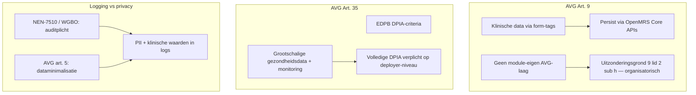
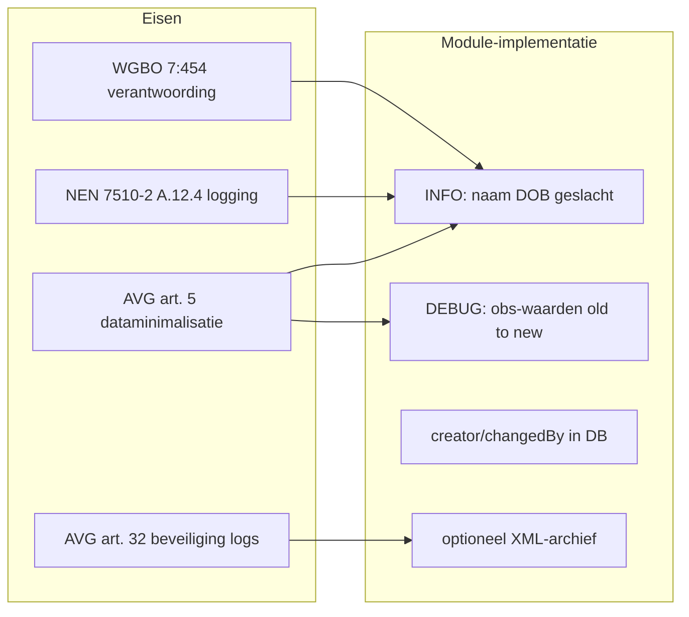

# 8. DPIA-check — bijzondere persoonsgegevens en logging

**Module:** OpenMRS HTML Form Entry v3.10.0  
**Datum:** 2026-06-15  
**Normkader:** AVG (art. 9, 35) · NEN-7510:2024-2  
**Scope:** Verwerkingskenmerken van de module; OpenMRS Core, hosting en organisatorische maatregelen vallen buiten deze bijlage

---

## 8.1 Scope en methodiek

Deze bijlage beantwoordt drie vragen voor de HTML Form Entry-module:

1. Hoe gaat de module om met **bijzondere persoonsgegevens** (AVG art. 9)?
2. Is een **volledige DPIA** verplicht (AVG art. 35)?
3. Waar ontstaat **spanning tussen logging en privacy**?

De beoordeling richt zich op de **verwerkingskenmerken** van de module, niet op een specifieke zorginstelling. Juridische conclusies zijn onder voorbehoud van de Functionaris Gegevensbescherming (FG) en juridisch adviseur van de verwerkingsverantwoordelijke.

**Bronnen:**

| Bron | Gebruik |
|------|---------|
| [`03-assets.md`](03-assets.md) | Art. 9-classificatie kroonjuwelen |
| [`01-gap-analyse.md`](01-gap-analyse.md) | Control A.8.15 logging-bevindingen |
| [`04-risicomatrix.md`](04-risicomatrix.md) | Dreigingen D2 (datalek) en D5 (insider-inzage) |
| [`05-bowtie.md`](05-bowtie.md) | Hazard: verwerking bijzondere persoonsgegevens |
| Broncode | Bewijs van verwerkingsflow en logging |



---

## 8.2 Omgaan met bijzondere persoonsgegevens (AVG art. 9)

### 8.2.1 Welke gegevens verwerkt de module?

De module is de formulierservice waarmee zorgverleners klinische gegevens invoeren en raadplegen. Alle onderstaande categorieën zijn in [`03-assets.md`](03-assets.md) geclassificeerd als **bijzondere persoonsgegevens** (AVG art. 9 lid 1).

| Categorie | Mechanisme in module | Bewijs |
|-----------|---------------------|--------|
| Klinische obs-data (vitals, diagnoses, labs, vrije tekst) | `<obs/>` → `ObsSubmissionElement`, `ObsTagHandler` | `api/src/main/java/org/openmrs/module/htmlformentry/element/ObsSubmissionElement.java` |
| Medicatieorders | `<drugOrder/>` | `api/src/main/java/org/openmrs/module/htmlformentry/element/DrugOrderSubmissionElement.java` |
| Patiëntidentiteit (NAW, BSN, geboortedatum) | `<patient>` | `api/src/main/java/org/openmrs/module/htmlformentry/element/PatientDetailSubmissionElement.java` |
| Encounters (datum, locatie, behandelaar) | `<encounterDate/>`, encounter-tags | `api/src/main/java/org/openmrs/module/htmlformentry/element/EncounterDetailSubmissionElement.java` |
| Immunisaties | `<immunization/>` | `api/src/main/java/org/openmrs/module/htmlformentry/element/ImmunizationSubmissionElement.java` |
| Relaties, programma-inschrijving, overlijden | overige tag handlers | diverse handlers in `api/src/main/java/org/openmrs/module/htmlformentry/` |

Daarnaast kunnen formulieren **binaire klinische data** (afbeeldingen, documenten) bevatten via file-upload-widgets op obs-velden.

### 8.2.2 Verwerkingsflow

De module fungeert als orchestratielaag; persistentie verloopt via OpenMRS Core-services:

1. **Render** — `FormEntrySession` wordt aangemaakt met het volledige `Patient`-object; Velocity-templates ontvangen `patient`, `user` en `session` in context.
2. **Invoer** — HTTP-parameter map via `HtmlFormEntryController`; sessie wordt tijdelijk in een per-gebruiker `WeakHashMap` bewaard.
3. **Persist** — `FormEntrySession.applyActions()` schrijft via `ObsService`, `PersonService`, `EncounterService` en aanverwante API's: void/create obs, encounters, personen, programma's, relaties en medicatieorders.
4. **Optioneel archief** — bij global property `htmlformentry.archiveHtmlForms=true` wordt de volledige parameter map als XML op schijf opgeslagen (`FormSubmissionController.java:97-120`).

### 8.2.3 Wat de module niet doet

De module bevat **geen AVG-specifieke laag**:

- Geen consentbeheer of grondslagregistratie
- Geen pseudonimisering of anonimisering van velden
- Geen ondersteuning voor inzage-, rectificatie- of verwijderingsverzoeken (art. 15–17)
- Geen versleuteling at rest of in transit op moduleniveau
- Geen data-minimalisatie in logs of archieven

AVG-naleving wordt **gedelegeerd** aan het OpenMRS-platform (authenticatie, database, back-ups) en aan de **verwerkingsverantwoordelijke** (zorginstelling: verwerkingsregister, FG, beleid).

### 8.2.4 Rechtmatigheid (organisatorische laag)

De technische grondslag voor verwerking staat niet in de modulecode. Voor Nederlandse zorgcontext geldt doorgaans:

| Grondslag | Toepassing |
|-----------|------------|
| **AVG art. 9 lid 2 onder h** | Verwerking noodzakelijk voor medische diagnose, gezondheidszorg of behandeling |
| **AVG art. 6 lid 1 onder c of f** | Wettelijke verplichting (WGBO) of gerechtvaardigd belang zorgverlening |
| **WGBO art. 7:454** | Verantwoordingsplicht over wie welk dossier heeft ingezien |

De module levert uitsluitend de **technische verwerkingsinfrastructuur**. De grondslag, doeleinden en bewaartermijnen moeten in het verwerkingsregister van de instelling staan.

### 8.2.5 Technische maatregelen in de module

| Maatregel | Status | Bewijs |
|-----------|--------|--------|
| Role-based access control | ⚠️ Gedeeltelijk | OpenMRS-privileges (`Form Entry`, `Edit Encounters`, `Manage Forms`); zie [`01-gap-analyse.md`](01-gap-analyse.md) A.8.3 |
| Database-audittrail | ✅ Aanwezig | `creator` / `changedBy` / `voidedBy` op entiteiten; `HtmlFormEntryServiceImpl.java:120,124` |
| Optionele formulierarchivering | ⚠️ Risico | Volledige parameter map op schijf; standaard uit |
| Versleuteling / masking | ❌ Afwezig | Niet geïmplementeerd in module |

---

## 8.3 DPIA-verplichting (AVG art. 35)

### 8.3.1 Toetsingskader

AVG art. 35 lid 1 verplicht een DPIA wanneer een verwerking waarschijnlijk een **hoog risico** oplevert voor de rechten en vrijheden van betrokkenen. Art. 35 lid 3 noemt verwerkingen waarvoor een DPIA **altijd** verplicht is, waaronder grootschalige verwerking van bijzondere categorieën (lid 3 onder b). Aanvullend gelden de [EDPB DPIA-criteria](https://edpb.europa.eu/our-work-tools/our-documents/guidelines/guidelines-42019-criteria-dpia_en) (WP248).

### 8.3.2 Checklist verwerkingskenmerken

| Criterium | Beoordeling | Motivatie t.o.v. module |
|-----------|-------------|-------------------------|
| Grootschalige verwerking bijzondere categorieën (35(3)(b)) | **Ja** | Elke ingediend formulier bevat obs-, medicatie- en/of identiteitsgegevens; in productie typisch alle patiënten van een instelling |
| Systematische monitoring (35(3)(c)) | **Gedeeltelijk** | Toegangslogging bij elke sessie (`FormEntrySession` INFO); geen dedicated SIEM in module; gebruikerstracking via OpenMRS-sessie |
| Nieuwe technologie / innovatief gebruik | **Gedeeltelijk** | Custom HTML-formulieren + Velocity-templates: flexibel maar risicovol (XSS, ongecontroleerde velden) |
| Kwetsbare betrokkenen (patiënten) | **Ja** | Expliciet zorgcontext; zie [`05-bowtie.md`](05-bowtie.md) hazard |
| Geautomatiseerde besluitvorming | **Nee** | Module slaat data op; geen algoritmische beslissingen |
| Data matching / combinatie | **Gedeeltelijk** | Koppeling patiënt + encounter + obs + medicatie in één sessie |
| Verwerking buiten zicht betrokkene | **Ja** | Backend-verwerking, application logs, optionele archiefkopie op schijf |
| Verwerking van locatiegegevens | **Gedeeltelijk** | Encounter-locatie kan in formulieren worden vastgelegd |

### 8.3.3 Conclusie art. 35

> Een **volledige DPIA is verplicht** voor de verwerkingsverantwoordelijke die deze module in productie neemt.

De module verwerkt op structurele wijze gezondheidsgegevens (art. 9) in een zorgsysteem. Dit valt onder de verplichte DPIA-drempel *grootschalige verwerking van gezondheidsgegevens* (art. 35 lid 3 onder b). Aanvullende criteria (kwetsbare betrokkenen, verwerking buiten zicht) versterken de verplichting.

**Afbakening:**

- De module zelf voert geen DPIA uit en bevat geen DPIA-artefacten.
- De verplichting rust op de **zorginstelling / FG**.
- De DPIA moet het **gehele verwerkingssysteem** omvatten: OpenMRS Core, database, hosting, back-ups, logging-infrastructuur en organisatorische maatregelen — niet alleen deze module.

**Input voor een DPIA:**

| DPIA-stap | Bron in dit audit |
|-----------|-------------------|
| Beschrijving verwerking | Sectie 8.2 van dit document + [`03-assets.md`](03-assets.md) |
| Noodzaak en proportionaliteit | Organisatorisch; module biedt geen grondslagregistratie |
| Risico's voor betrokkenen | [`04-risicomatrix.md`](04-risicomatrix.md) D2 (datalek, score 20), D5 (insider-inzage, score 12) |
| Mitigerende maatregelen | [`01-gap-analyse.md`](01-gap-analyse.md), [`05-bowtie.md`](05-bowtie.md) preventieve barrières |
| Logging-risico | Sectie 8.4 van dit document |

---

## 8.4 Spanning tussen logging en privacy

### 8.4.1 Twee tegengestelde eisen

Zorgorganisaties moeten **wie** welk dossier heeft ingezien kunnen aantonen (NEN-7510-2 §A.12.4, WGBO art. 7:454). Tegelijkertijd vereist de AVG **dataminimalisatie** (art. 5 lid 1 onder c) en passende beveiliging van verwerkte gegevens (art. 32). Application logs zijn een **eigen verwerking** van persoonsgegevens: wie toegang heeft tot logs, heeft indirect toegang tot patiëntdata.



### 8.4.2 Waarom logging nodig is

- **Verantwoordingsplicht** — aantonen welke gebruiker op welk moment een patiëntdossier heeft geopend of gewijzigd.
- **Detectie misbruik** — ondersteuning bij onderzoek naar onbevoegde inzage (dreiging D5 in [`04-risicomatrix.md`](04-risicomatrix.md)).
- **Forensisch onderzoek** — na een datalek (D2) zijn toegangslogs essentieel bewijsmateriaal.
- **NEN-7510-compliance** — [`01-gap-analyse.md`](01-gap-analyse.md) A.8.15 beoordeelt toegangslogging als ✅ aanwezig (`FormEntrySession.java:145-148`).

### 8.4.3 Waar de module de privacy ondermijnt

**1. Over-logging van identificerende gegevens (INFO)**

Bij elke formuliersessie logt de module patiëntnaam, geboortedatum en geslacht in plaintext:

```144:148:api/src/main/java/org/openmrs/module/htmlformentry/FormEntrySession.java
        // Audit logging for HIPAA compliance — records patient access with identifying information
        log.info("FormEntrySession created: patient=" + patient.getPatientIdentifier()
                + " dob=" + patient.getBirthdate()
                + " gender=" + patient.getGender()
                + " names=" + patient.getPersonName());  // PII logged to application log
```

Het commentaar verwijst naar HIPAA-compliance, maar de implementatie **overschrijdt** wat voor AVG-doeleinden nodig is: een `userId` + `patientUuid` + timestamp volstaat voor toegangscontrole.

**2. Klinische inhoud in DEBUG-logs**

Bij elke obs-wijziging worden oude en nieuwe waarden gelogd:

```331:336:api/src/main/java/org/openmrs/module/htmlformentry/FormSubmissionActions.java
		Obs newObs = HtmlFormEntryUtil.createObs(concept, newValue, newDatetime, accessionNumber);
		String oldString = existingObs.getValueAsString(Context.getLocale());
		String newString = newObs.getValueAsString(Context.getLocale());
		if (log.isDebugEnabled() && concept != null) {
			log.debug("For concept " + concept.getName(Context.getLocale()) + ": " + oldString + " -> " + newString);
		}
```

Met de standaard logconfiguratie op DEBUG (`api/src/main/resources/log4j.xml:13-14`) kunnen diagnoses, lab-uitslagen en vitale waarden in application logs terechtkomen.

**3. Dubbele verwerking via archivering**

Bij ingeschakelde archivering (`htmlformentry.archiveHtmlForms`) wordt `submission.getParameterMap()` als plaintext XML opgeslagen — een tweede kopie van alle ingediende velden, naast de database.

**4. Foutdisclosure naar de browser**

Bij submit-fouten worden stack traces aan de eindgebruiker getoond:

```328:332:omod/src/main/java/org/openmrs/module/htmlformentry/web/controller/HtmlFormEntryController.java
        } catch (Exception ex) {
            log.error("Exception trying to submit form", ex);
            StringWriter sw = new StringWriter();
            ex.printStackTrace(new PrintWriter(sw));
            errors.reject("Exception! " + ex.getMessage() + "<br/>" + sw.toString());
```

**5. Geen logbeveiliging**

[`01-gap-analyse.md`](01-gap-analyse.md) A.8.15 items 9–11: geen integriteitsbeveiliging, geen centrale aggregatie, geen retentie- of rotatiebeleid. Logs worden naar console geschreven (`log4j.xml`) zonder toegangscontrole op het logbestand zelf.

### 8.4.4 De spanning samengevat

| Behoefte | Privacy-eis | Huidige module | Spanning |
|----------|-------------|----------------|----------|
| Wie heeft dossier geopend? | Log alleen `userId` + `patientUuid` | Logt ook naam, DOB, geslacht | Overtollige identificatie in logs |
| Wat is gewijzigd? | Audittrail op entiteitsniveau (DB) volstaat | Logt oude/nieuwe klinische waarden op DEBUG | Dubbele opslag gevoelige inhoud |
| Bewijs van inzage | Logs beschermd, beperkte retentie | Console-only, geen beleid | Logs zelf worden risico |
| Foutafhandeling | Generieke melding aan gebruiker | Volledige stack trace in UI | Onnodige openbaarmaking |

De gap-analyse bevestigt deze spanning: toegangslogging wordt als ✅ beoordeeld (item #3), maar PII-conformiteit als ⚠️ gedeeltelijk (item #13).

### 8.4.5 Aanbevolen evenwicht

| Maatregel | Rationale |
|-----------|-----------|
| Toegangslog: `userId` + `patientUuid` + `formId` + timestamp | Voldoet aan verantwoordingsplicht zonder naam/DOB |
| Klinische wijzigingen: alleen database-audittrail (`creator`/`changedBy`) | Dataminimalisatie; DB-trail is al aanwezig |
| Productie-logniveau: INFO of WARN, nooit DEBUG voor `htmlformentry` | Voorkomt klinische waarden in logs |
| Centrale log-aggregator met RBAC, retentie (min. 1 jaar), integriteitscontrole | NEN-7510-2 §A.12.4 + AVG art. 32 |
| Archivering standaard uit; indien aan: versleuteling + toegangsbeheer | Beperkt dubbele verwerking |
| Foutmeldingen: generieke tekst naar UI, details alleen in beveiligde logs | Voorkomt disclosure via browser |

Concrete codewijziging: vervang `FormEntrySession.java:145-148` door pseudonimiseerde identifier (zie [`01-gap-analyse.md`](01-gap-analyse.md) verbetering bij item #13).

---

## 8.5 Conclusie

1. **Art. 9** — De module is een brede conduit voor bijzondere persoonsgegevens (obs, medicatie, identiteit, immunisaties). Er is geen ingebouwde AVG-compliance; rechtmatigheid en grondslag zijn organisatorische verantwoordelijkheid.

2. **Art. 35** — Een **volledige DPIA is verplicht** bij productie-inzet. De verwerkingskenmerken (grootschalige gezondheidsdata, kwetsbare betrokkenen, verwerking buiten zicht) overschrijden de verplichte drempel. Dit document levert module-specifieke input; de DPIA zelf is een verantwoordelijkheid van de zorginstelling.

3. **Logging vs. privacy** — Het meest concrete technische probleem is de spanning tussen auditplicht en dataminimalisatie. De HIPAA-intentie in `FormEntrySession` botst met AVG art. 5: de module logt meer identificerende en klinische data dan noodzakelijk, terwijl de database-audittrail (`creator`/`changedBy`) al volstaat voor verantwoording.

4. **Vervolgacties** — Mitigaties staan in [`01-gap-analyse.md`](01-gap-analyse.md) (items #9–13, A.8.15) en de preventieve maatregelen in [`05-bowtie.md`](05-bowtie.md). Prioriteit: pseudonimiseerde toegangslogs, DEBUG uitschakelen in productie, beveiligde log-infrastructuur.

---

*Onder voorbehoud van definitieve beoordeling door FG en juridisch adviseur van de verwerkingsverantwoordelijke.*
