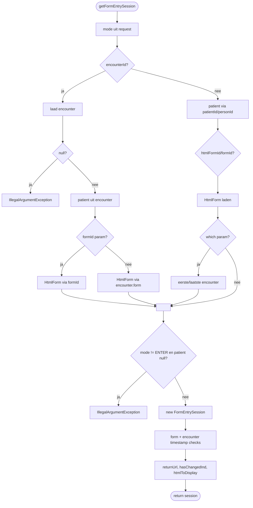
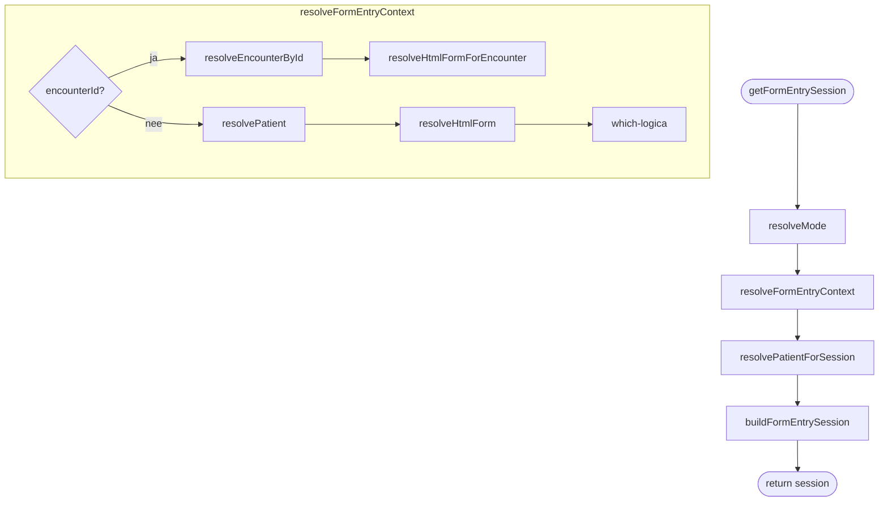

# Ontwerp refactoring - HtmlFormEntryController

**Taak:** LU2-38 - 4.8 Aangepast ontwerp  
**Branch:** `refactor/htmlformentry-controller-poc`  
**Datum:** 2026-06-18  
**Auteur:** Floris Bogers  
**Scope:** `HtmlFormEntryController.getFormEntrySession` (PoC-hotspot)

---

## 1. As-is situatie

### 1.1 Probleemstelling

`HtmlFormEntryController.getFormEntrySession` was een 143-regel methode met een cognitieve complexiteit van **CC 52** (drempel: 15). De methode deed alles in één adem:

- mode bepalen uit request-parameter
- encounter ophalen via id of uuid
- patient ophalen via encounter of patientId/personId
- HtmlForm ophalen via formId of htmlFormId
- "which"-logica: eerste of laatste encounter selecteren
- sessie aanmaken (`FormEntrySession`)
- concurrency-checks op form- en encounter-timestamps
- return URL en overige sessiemetadata zetten

Door deze opeenstapeling van verantwoordelijkheden was de methode vrijwel onmogelijk te unit-testen zonder een volledige Spring-context op te starten. De coverage op `HtmlFormEntryController` was **2,1%** bij aanvang van de PoC.

### 1.2 As-is flowchart



### 1.3 Kwaliteitsproblemen baseline

| Metriek | Waarde | Drempel | Status |
|---------|--------|---------|--------|
| Cognitive complexity | CC 52 | <= 15 | overschreden met +37 |
| Line coverage | 2,1% | >= 60% | niet voldaan |
| Dedicated unit tests | 0 | >= 1 per hotspot | niet aanwezig |
| SonarCloud Brain Method smell | aanwezig (Major) | 0 new | aanwezig |

---

## 2. Alternatieven

Drie ontwerprichtingen zijn overwogen.

### 2.1 Extract Class - `FormEntryRequestResolver`

De oorspronkelijke planning was het extraheren van alle resolving-logica naar een aparte top-level klasse `FormEntryRequestResolver`. De controller zou dan enkel delegeren:

```java
// Concept - niet geimplementeerd
FormEntryRequestResolver resolver = new FormEntryRequestResolver(encounterServiceCompatibility);
FormEntryResolution resolution = resolver.resolve(request, formId, htmlFormId, patientId);
FormEntrySession session = sessionFactory.build(resolution, request);
```

**Voordelen:** sterke SRP-scheiding; `FormEntryRequestResolver` volledig unit-testbaar met Mockito; controller wordt klein.

**Nadelen:**
- Introduceert een nieuw top-level productie-type dat Spring moet injecteren of handmatig aangemaakt moet worden
- `FormEntrySession`-constructie blijft in de controller - twee klassen doen dan elk een deel van het werk
- Grotere diff, meer risico op introduceren van bugs in de Spring-wiring
- De rubric-eis "Extract Class" vereist een aparte `.java`-file; bij Extract Method binnen dezelfde klasse is dat niet nodig

### 2.2 Delegate naar `FormEntrySession`

De TODO-comment in de broncode suggereert al dat de logica eigenlijk in `FormEntrySession` thuis hoort:

```java
// TODO: This has a bit too much logic in the onSubmit method.
// Move that into the FormEntrySession.
```

Alle resolving-logica zou dan in `FormEntrySession` terechtkomen, en de controller roept alleen `FormEntrySession.fromRequest(request)` aan.

**Voordelen:** architectureel de meest zuivere oplossing; alles op de juiste laag.

**Nadelen:**
- `FormEntrySession` heeft al ~1000 LOC en een eigen complexiteitsprobleem
- Elk wijziging aan `FormEntrySession` raakt de volledige `api`-module, met een hoog regressierisico
- Herschrijven van `FormEntrySession` valt ruim buiten de sprintcapaciteit
- Dit is een strategisch verbeterpunt voor een latere fase, niet voor deze PoC

### 2.3 Extract Method binnen dezelfde klasse (gekozen)

De gekozen aanpak: de resolving-verantwoordelijkheden opsplitsen in package-private methoden binnen `HtmlFormEntryController` zelf. `getFormEntrySession` wordt een dunne orkestrator die delegeert naar de nieuwe methoden.

**Voordelen:**
- Geen nieuwe klasse-grenzen, geen Spring-injectie-risico
- Elke geextraheerde methode is zelfstandig testbaar via de bestaande test-infrastractuur
- `getFormEntrySession` daalt van CC 52 naar CC 2 - ruim onder de drempel
- Characterization tests (T1-T9) kunnen ongewijzigd blijven als refactor-vangnet
- Kleinste diff, laagste regressierisico

**Nadelen:**
- Controller blijft groot in LOC (567 regels na refactor, inclusief `handleSubmit` en `FormEntryResolution`)
- SRP niet volledig: controller orkestreert nog steeds resolving + sessie-opbouw
- `FormEntryResolution` is een inner class, geen top-level type

**Keuze-motivatie o.b.v. NFRs:**

| NFR | Bijdrage Extract Method |
|-----|------------------------|
| M1 - CC <= 15 | CC 52 -> CC 2 op hotspot; alle nieuwe methoden < 15 |
| M3 - 0 new smells | Brain Method smell opgelost; geen nieuwe smells op new code |
| M4 - testbaarheid | Elke resolve-methode individueel testbaar; T1-T9 blijven groen |

---

## 3. To-be ontwerp

### 3.1 Structuur na refactoring

`getFormEntrySession` delegeert naar vier geextraheerde methoden. Een inner value object `FormEntryResolution` groepeert de resultaten van de context-resolutie.

```
HtmlFormEntryController
+-- getFormEntrySession()          [CC 2 - orkestratie]
|     |-- resolveMode()            [CC 1]
|     |-- resolveFormEntryContext() [CC 8 - coördineert onderstaande]
|     |     |-- resolveEncounterById()
|     |     |-- resolveHtmlFormForEncounter()
|     |     |-- resolvePatient()
|     |     |-- resolveHtmlForm()
|     |-- resolvePatientForSession() [CC 5]
|     +-- buildFormEntrySession()   [CC <= 10 - sessie + timestamps]
+-- FormEntryResolution (inner class)
      patient, encounter, htmlForm, personId, patientId
```

### 3.2 To-be flowchart



### 3.3 Verantwoordelijkheden per methode

| Methode | Verantwoordelijkheid | CC na |
|---------|----------------------|-------|
| `getFormEntrySession` | Orkestratie - aanroepen van de vier stappen en return | 2 |
| `resolveMode` | mode-param uit request -> `Mode` enum | 1 |
| `resolveFormEntryContext` | Coordineert encounter/patient/htmlForm-resolutie; geeft `FormEntryResolution` terug | 8 |
| `resolveEncounterById` | Encounter opzoeken via id of uuid; gooit bij null | 2 |
| `resolveHtmlFormForEncounter` | HtmlForm bepalen via formId-param of encounter.form | 3 |
| `resolvePatient` | Patient opzoeken via personId | 2 |
| `resolveHtmlForm` | HtmlForm bepalen via htmlFormId of formId | 3 |
| `resolvePatientForSession` | Fallback naar lege Patient bij ENTER-mode; check bij VIEW/EDIT | 5 |
| `buildFormEntrySession` | `FormEntrySession` aanmaken + timestamp-concurrency-checks + metadata | <= 10 |
| `FormEntryResolution` | Immutable value object; groepeert patient, encounter, htmlForm, ids | 0 |

### 3.4 Afwijking t.o.v. oorspronkelijk plan

Het originele plan (zie [`03-teststrategie.md`](../03-teststrategie.md) §7.2) voorzag in een aparte top-level klasse `FormEntryRequestResolver`. De implementatie is Extract Method gebleven, om de redenen in §2.3. Dit is in het validatiedocument [`07-validatie-voor-na.md`](../07-validatie-voor-na.md) verantwoord.

Als praktische maatstaf voor SRP gold het streven naar `< 200 LOC` voor de controller na refactoring (gebaseerd op de initiële NFR-versie). De controller telt na de PoC 567 regels - dit wordt niet gehaald. De motivatie: `handleSubmit` (~65 regels, CC 22) en de `FormEntryResolution` inner class zijn bewust niet aangeraakt in deze PoC. Het verlagen van de controller-LOC vereist een vervolgstap (Extract Class voor `handleSubmit`, of delegatie naar `FormEntrySession`). Dit wordt als strategische schuld vastgelegd in §4.

---

## 4. Resterende technische schuld

| Onderdeel | Probleem | Prioriteit | Aanpak |
|-----------|----------|------------|--------|
| `handleSubmit` | CC 22, ~65 LOC, niet gerefactord | Middel | Extract Method of Extract Class in volgende sprint |
| `PopupWidgetController.personSearch` | CC 55 - grootste hotspot buiten PoC | Laag | Aparte PoC nodig |
| `HtmlFormSearchController.conceptSearch` | CC 29 | Laag | Vergelijkbaar patroon als deze PoC |
| `FormEntrySession` | ~1000 LOC, architecturele schuld | Hoog strategisch | Grote refactor; valt buiten sprintcapaciteit |
| Controller LOC | 567 regels - boven 200 LOC-drempel | Laag | Vervolgstap na handleSubmit-refactor |

---

## 5. Relatie met NFRs

| NFR | Eis | Ontwerp-keuze | Status |
|-----|-----|---------------|--------|
| M1 - CC <= 15 | Geen methode > CC 15 in PoC-scope na refactor | Extract Method verlaagt hotspot van 52 -> 2; alle nieuwe methoden < 15 | voldaan |
| M3 - 0 new smells | 0 nieuwe smells op gewijzigde code | Geen nieuwe code-paden geintroduceerd; Brain Method opgelost | voldaan |
| M4 - testbaarheid | 100% hotspots gedekt; geextraheerde methoden testbaar | Elke methode unit-testbaar; 18 tests toegevoegd | voldaan |
| M3 (smells) | 0 nieuwe smells op gewijzigde code; Brain Method opgelost | Behaald; 567 LOC is een praktisch aandachtspunt, geen NFR-M3 eis - zie §3.4 | voldaan |

---

## 6. Referenties

| Document | Locatie |
|----------|---------|
| NFR onderhoudbaarheid | [`docs/01-nfr-onderhoudbaarheid.md`](../01-nfr-onderhoudbaarheid.md) |
| Teststrategie | [`docs/03-teststrategie.md`](../03-teststrategie.md) |
| Testresultaten baseline | [`docs/04-testresultaten-baseline.md`](../04-testresultaten-baseline.md) |
| Validatie voor/na | [`docs/07-validatie-voor-na.md`](../07-validatie-voor-na.md) |
| AI-verantwoording | [`docs/05-verantwoording-ai-tests.md`](../05-verantwoording-ai-tests.md) |
| Onderhoudbaarheidsrapport | [`docs/onderhoudbaarheidsrapport.md`](../onderhoudbaarheidsrapport.md) |
